> 笔记来源：[尚硅谷JVM全套教程，百万播放，全网巅峰（宋红康详解java虚拟机）](https://www.bilibili.com/video/BV1PJ411n7xZ "尚硅谷JVM全套教程，百万播放，全网巅峰（宋红康详解java虚拟机）")
>
> 同步更新：https://gitee.com/vectorx/NOTE_JVM
>
> https://codechina.csdn.net/qq_35925558/NOTE_JVM
>
> https://github.com/uxiahnan/NOTE_JVM

[TOC]

# 2. 类加载子系统

## 2.1. 内存结构概述

- Class文件
- <mark>类加载子系统</mark>
- 运行时数据区
  - 方法区
  - 堆
  - 程序计数器
  - 虚拟机栈
  - 本地方法栈
- 执行引擎
- 本地方法接口
- 本地方法库

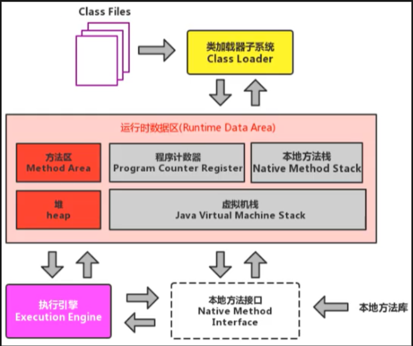


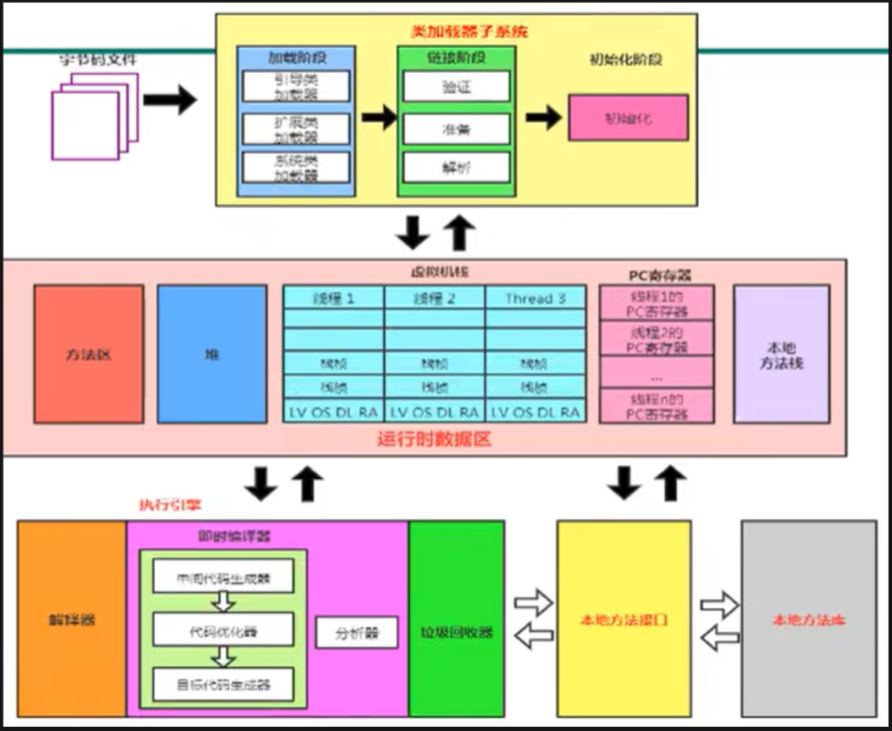


如果自己想手写一个Java虚拟机的话，主要考虑哪些结构呢？

- 类加载器
- 执行引擎

## 2.2. 类加载器与类的加载过程

**类加载器子系统作用**

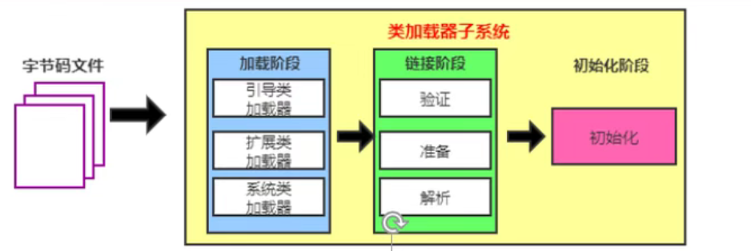

- 类加载器子系统负责从文件系统或者网络中加载Class文件，class文件在文件开头有特定的文件标识。
- ClassLoader只负责class文件的加载，至于它是否可以运行，则由执行引擎Execution Engine决定，婚姻介绍所只负责给你女方的联系方式，但是能不能成，就看自己了，婚姻介绍所就是类加载器，而自己就是执行引擎。
- class文件只是物理磁盘上的一个文件，**加载的类信息存放于一块称为方法区的内存空间**。除了类的信息外，**方法区中还会存放运行时常量池信息**，可能还包括字符串字面量和数字常量（这部分常量信息是Class文件中常量池部分的内存映射）
- 常量池：在我们反编译之后的**字节码中**可以看到**常量池**的信息，常量池由**类加载器加载到内存中**之后就成为了**运行时常量池**
  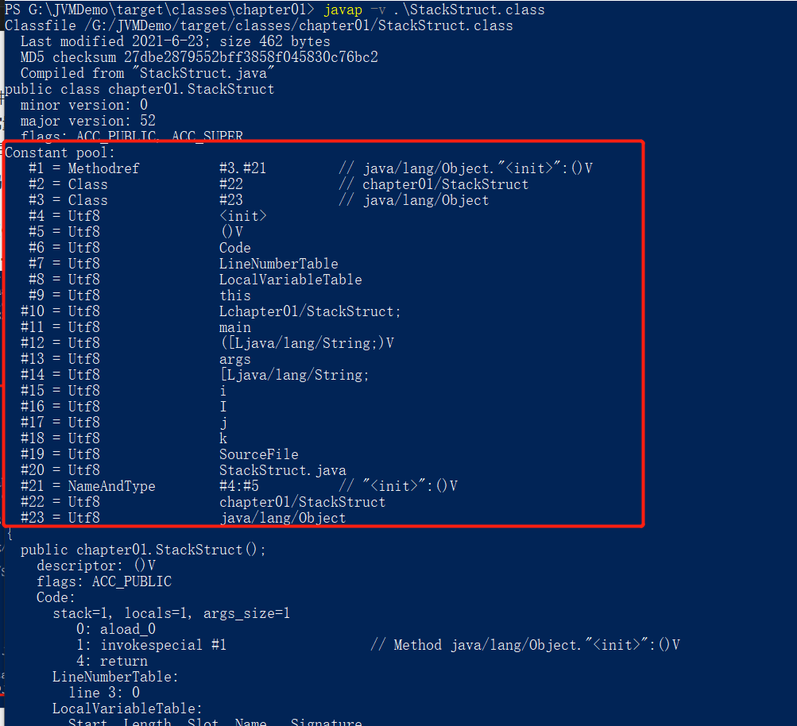

**类加载器ClassLoader角色**

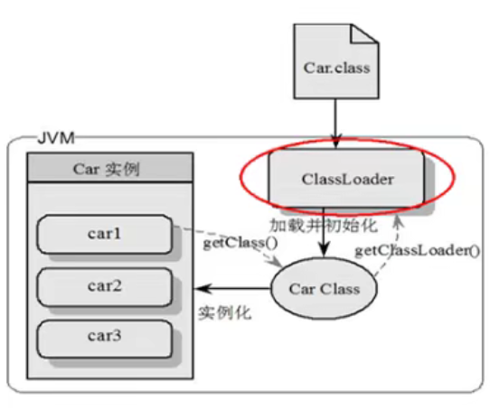

- class file存在于本地硬盘上，可以理解为设计师画在纸上的模板，而最终这个模板在执行的时候是要加载到JVM当中来根据这个文件实例化出n个一模一样的实例。
- class file加载到JVM中，被称为DNA元数据模板，放在**方法区**。
- 在.class文件 -> JVM -> 最终成为元数据模板，此过程就要一个运输工具（类装载器Class Loader），扮演一个快递员的角色，方法getClassLoader()可以用来获取加载该字节码的**类加载器实例**。

**类的加载过程**

```java
/**
 *示例代码
 */
public class HelloLoader {
    public static void main(String[] args) {
        System.out.println("Hello World!");
    }
}
```

用流程图表示上述示例代码：

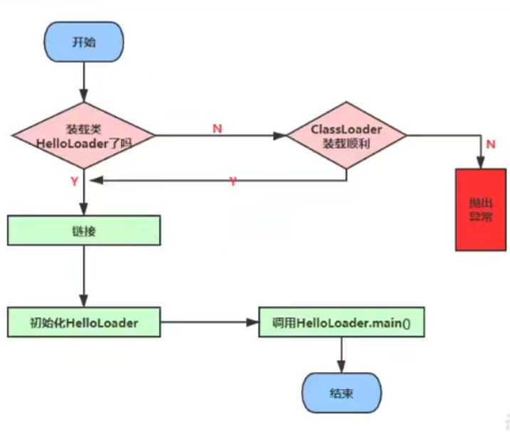

## 类的加载过程

### 加载阶段


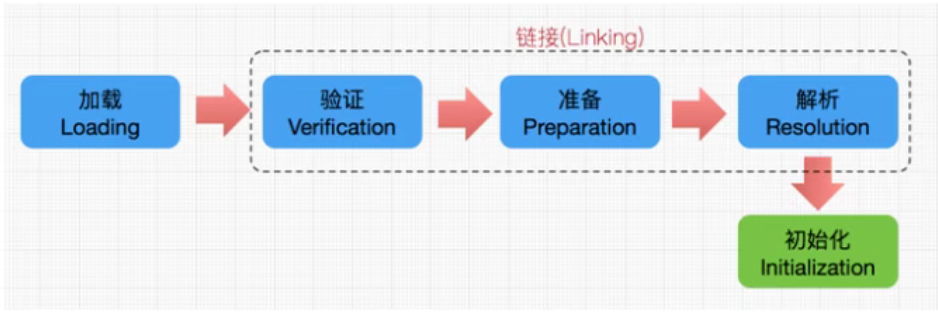

- 1. 通过一个类的全限定名获取定义此类的二进制字节流
- 2. 将这个**字节流所代表的静态存储结构转化为方法区（永久代、元空间）的运行时数据结构**
- 3. 在内存中生成一个代表这个类的java.lang.Class对象，作为方法区这个类的各种数据的访问入口

**补充：加载class文件的方式**

- 从<mark>本地系统</mark>中直接加载
- 通过<mark>网络</mark>获取，典型场景：Web Applet
- 从zip<mark>压缩包</mark>中读取，成为日后jar、war格式的基础
- 运行时计算生成，使用最多的是：<mark>动态代理技术</mark>
- 由其他文件生成，典型场景：<mark>JSP应用</mark>
- 从专有<mark>数据库</mark>中提取.class文件，比较少见
- 从<mark>加密文件</mark>中获取，典型的防Class文件被反编译的保护措施

**需要注意的是生成Class对象的实例是在这个阶段做的。**

###  链接阶段

- **验证（Verify）**：
  - 目的在于确保Class文件的字节流中包含信息符合当前虚拟机要求，保证被加载类的正确性，不会危害虚拟机自身安全。
  - 主要包括四种验证，<mark>文件格式验证，元数据验证，字节码验证，符号引用验证。</mark>
- **准备（Prepare）**：
  - **为类变量（静态变量）分配内存**并且设置该类变量（静态变量）的默认初始值，即零值。
  
  - <mark>这里不包含用final修饰的static，因为final在编译的时候就会分配了，准备阶段会显式初始化；</mark>
  
  - <mark>这里不会为实例变量分配初始化</mark>，类变量会分配在方法区中，而实例变量是会随着对象一起分配到Java堆中。
  
  - ```java
    public class HelloApp {
        /**
         * 这个值在准备阶段 prepare阶段 : a = 0
         * 此值在初始化阶段 initial阶段才会被赋值为1: a = 1
         */
        private static int a = 1;
    
        public static void main(String[] args) {
            System.out.println(a);
        }
    }
    ```
  
  - 
- **解析（Resolve）**：
  
  - 将常量池内的<mark>符号引用转换为直接引用</mark>的过程。
  - 事实上，解析操作往往会伴**随着JVM在类加载过程中执行完初始化阶段之后再执行。**
  - 符号引用就是一组符号来描述所引用的目标。符号引用的字面量形式明确定义在《java虚拟机规范》的Class文件格式中。直接引用就是直接指向目标的指针、相对偏移量或一个间接定位到目标的句柄。
  - 解析动作主要针对类或接口、字段、类方法、接口方法、方法类型等。对应常量池中的CONSTANT_Class_info，CONSTANT_Fieldref_info、CONSTANT_Methodref_info等。

### 初始化阶段

- <mark>初始化阶段就是执行类构造器方法&lt;clinit&gt;()的过程。</mark>

- 此方法不需定义，是javac编译器自动收集类中的所有**类变量**的赋值动作和**静态代码块**中的语句合并而来,**将类变量的赋值操作和静态代码块中的操作抽取出来合并成clinit()方法。**

- ```java
  public class ClassInitTest {
      private static int num = 1;
  
      public static void main(String[] args) {
          System.out.println(ClassInitTest.num);
      }
  }
  ```

  使用jclasslib反编译之后。

  ```bash
  Classfile /workspace/JavaProject/JVMDemo/target/classes/chapter02/HelloApp.class
    Last modified 2021-11-19; size 594 bytes
    MD5 checksum 2fdc06902924410371524def87dff7d4
    Compiled from "HelloApp.java"
  public class chapter02.HelloApp
    minor version: 0
    major version: 52
    flags: ACC_PUBLIC, ACC_SUPER
  Constant pool:	# ***********常量池在这里***********
     #1 = Methodref          #6.#23         // java/lang/Object."<init>":()V
     #2 = Fieldref           #24.#25        // java/lang/System.out:Ljava/io/PrintStream;
     #3 = Fieldref           #5.#26         // chapter02/HelloApp.a:I
     #4 = Methodref          #27.#28        // java/io/PrintStream.println:(I)V
     #5 = Class              #29            // chapter02/HelloApp
     #6 = Class              #30            // java/lang/Object
     #7 = Utf8               a
     #8 = Utf8               I
     #9 = Utf8               <init>
    #10 = Utf8               ()V
    #11 = Utf8               Code
    #12 = Utf8               LineNumberTable
    #13 = Utf8               LocalVariableTable
    #14 = Utf8               this
    #15 = Utf8               Lchapter02/HelloApp;
    #16 = Utf8               main
    #17 = Utf8               ([Ljava/lang/String;)V
    #18 = Utf8               args
    #19 = Utf8               [Ljava/lang/String;
    #20 = Utf8               <clinit>
    #21 = Utf8               SourceFile
    #22 = Utf8               HelloApp.java
    #23 = NameAndType        #9:#10         // "<init>":()V
    #24 = Class              #31            // java/lang/System
    #25 = NameAndType        #32:#33        // out:Ljava/io/PrintStream;
    #26 = NameAndType        #7:#8          // a:I
    #27 = Class              #34            // java/io/PrintStream
    #28 = NameAndType        #35:#36        // println:(I)V
    #29 = Utf8               chapter02/HelloApp
    #30 = Utf8               java/lang/Object
    #31 = Utf8               java/lang/System
    #32 = Utf8               out
    #33 = Utf8               Ljava/io/PrintStream;
    #34 = Utf8               java/io/PrintStream
    #35 = Utf8               println
    #36 = Utf8               (I)V
  {
    public chapter02.HelloApp();
      descriptor: ()V
      flags: ACC_PUBLIC
      Code:
        stack=1, locals=1, args_size=1
           0: aload_0
           1: invokespecial #1                  // Method java/lang/Object."<init>":()V
           4: return
        LineNumberTable:
          line 3: 0
        LocalVariableTable:
          Start  Length  Slot  Name   Signature
              0       5     0  this   Lchapter02/HelloApp;
  
    public static void main(java.lang.String[]);
      descriptor: ([Ljava/lang/String;)V
      flags: ACC_PUBLIC, ACC_STATIC
      Code:
        stack=2, locals=1, args_size=1
           0: getstatic     #2                  // Field java/lang/System.out:Ljava/io/PrintStream;
           3: getstatic     #3                  // Field a:I
           6: invokevirtual #4                  // Method java/io/PrintStream.println:(I)V
           9: return
        LineNumberTable:
          line 11: 0
          line 12: 9
        LocalVariableTable:
          Start  Length  Slot  Name   Signature
              0      10     0  args   [Ljava/lang/String;
  
    static {};
      descriptor: ()V
      flags: ACC_STATIC
      Code:
        stack=1, locals=0, args_size=0
           0: iconst_1
           1: putstatic     #3                  // Field a:I
           4: return
        LineNumberTable:
          line 8: 0
  }
  SourceFile: "HelloApp.java"
  
  ```
  
  修改代码
  
  ```java
  public class ClassInitTest {
      private static int num = 1;
  
      static {
          num = 2;
      }
  
      public static void main(String[] args) {
          System.out.println(ClassInitTest.num);
      }
  }
  ```
  
  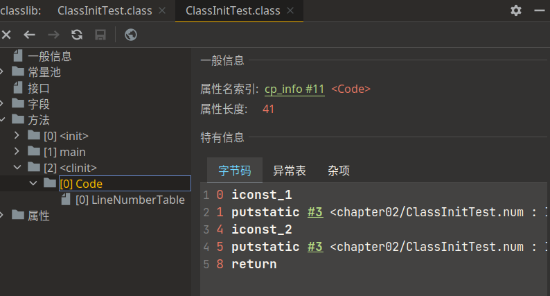
  
- 构造器方法中指令按语句在源文件中出现的顺序执行。

  ```java
  public class ClassInitTest {
      private static int num = 1;
  
      static {
          num = 2;
          number = 20;
      }
  
      /**
       * 该变量在prepare阶段会分配内存，并且初始化值为0，
       * 然后在initial阶段，这个number变量已经有了存储空间，然后
       * <clinit>()方法将所有静态变量的操作收集起来进行执行，
       * 执行时按顺序执行，最后这个number的值会被赋值为10
       * prepare:number = 0
       * initial:number:20 -> 10
       */
      private static int number =10;
  
      public static void main(String[] args) {
          System.out.println(ClassInitTest.num);
          System.out.println(ClassInitTest.number);
      }
  }
  ```

  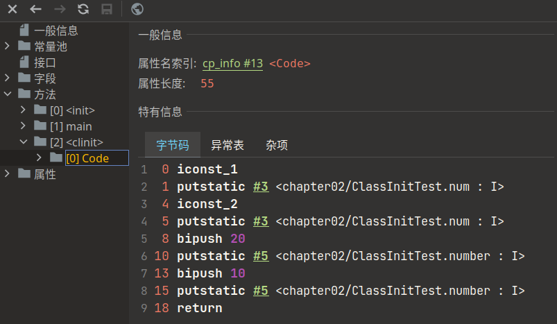

- <mark>&lt;clinit&gt;()不同于类的构造器。</mark>（关联：构造器是虚拟机视角下的&lt;init&gt;()）

  ```java
  public class ClinitTest {
      private int a = 1;
  
      public static void main(String[] args) {
          int b = 2;
      }
  }
  ```

  由于没有静态变量，所以就不会生成&lt;clinit>()方法了，所以&lt;clinit>()是用来处理静态变量初始化的。

  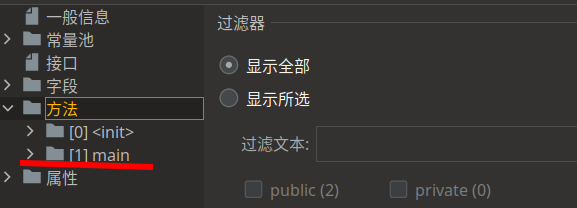

  由上述可以看到，任何一个类声明之后，内置至少存在一个类构造器，就是&lt;init>()方法。

  ```java
  package chapter02;
  
  public class ClinitTest {
      private int a = 1;
  
      public ClinitTest(){
          a = 10;
          int d = 20;
      }
      public static void main(String[] args) {
          int b = 2;
      }
  }
  ```

  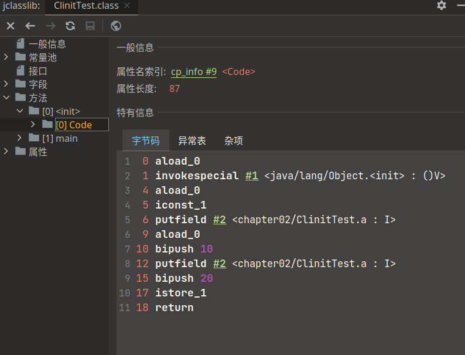

- 若该类具有父类，JVM会保证子类的&lt;clinit&gt;()执行前，父类的&lt;clinit&gt;()已经执行完毕。

  ```java
  public class ClinitTest2 {
      static class Father{
          public static int A = 1;
          static {
              A = 2;
          }
      }
  
      static class Son extends Father{
          public static int B = A;
      }
  //加载Father类 加载->链接->初始化，然后加载Son类 加载->链接->初始化
      public static void main(String[] args) {
          System.out.println(Son.B);
      }
  }
  ```

- 虚拟机必须保证一个类的&lt;clinit&gt;()方法在多线程下被同步加锁，虚拟机在执行类的加载的时候只会调用一次clinit()方法。

  ```java
  public class DeadThreadTest {
      public static void main(String[] args) {
          Runnable r = () -> {
              System.out.println(Thread.currentThread().getName() + "开始");
              DeadThread deadThread = new DeadThread();
              System.out.println(Thread.currentThread().getName() + "结束");
          };
          
          Thread t1 = new Thread(r,"线程1");
          Thread t2 = new Thread(r,"线程2");
      }
  }
  
  
  class DeadThread{
      static {
          if (true){
              System.out.println(Thread.currentThread().getName() + "初始化当前类");
              //由于设定了死循环，所以该类的加载过程是无法结束的，是无法加载完的
              while (true){
  
              }
          }
      }
  }
  ```

  ```bash
  线程1开始
  线程2开始
  线程1初始化当前类
  ```
  
  可以发现，线程1抢占到了初始化DeadThread,但是该类只会被初始化一次，线程1抢到了，线程2进入了阻塞状态。所以，只能看到线程1来初始化该类。

## 2.3. 类加载器分类

JVM支持两种类型的类加载器 。分别为<mark>引导类加载器（Bootstrap ClassLoader）</mark>和<mark>自定义类加载器（User-Defined ClassLoader）</mark>。

从概念上来讲，自定义类加载器一般指的是程序中由开发人员自定义的一类类加载器，但是Java虚拟机规范却没有这么定义，而是将<mark>所有派生于抽象类ClassLoader的类加载器都划分为自定义类加载器</mark>，所以Extension Class Loader和System Class Loader都属于自定义类加载器。

无论类加载器的类型如何划分，在程序中我们最常见的类加载器始终只有3个，如下所示：


这里的四者之间的关系是包含关系。不是上层下层，也不是子父类的继承关系。

```java
public class ClassLoaderTest {
    public static void main(String[] args) {
        //获取系统类加载器
        ClassLoader systemClassLoader = ClassLoader.getSystemClassLoader();
        System.out.println(systemClassLoader);//sun.misc.Launcher$AppClassLoader@18b4aac2
        //获取系统类加载器的上层：扩展类加载器
        ClassLoader extClassLoader = systemClassLoader.getParent();
        System.out.println(extClassLoader); //sun.misc.Launcher$ExtClassLoader@1b6d3586
        //获取扩展类加载器的上层: 引导类加载器,获取不到
        ClassLoader bootstrapClassLoader = extClassLoader.getParent();
        System.out.println(bootstrapClassLoader); //null 获取不到

        //对于用户自定义类来说：默认使用 系统类加载器加载
        ClassLoader classLoader = ClassLoaderTest.class.getClassLoader();
        System.out.println(classLoader); //sun.misc.Launcher$AppClassLoader@18b4aac2

        //可以发现也获取不到，所以间接推测到是使用引导类加载器加载的
        //所以推出：Java的核心类库都是使用引导类加载器加载的
        ClassLoader strClassLoader = String.class.getClassLoader();
        System.out.println(strClassLoader); //null
    }
}
```

### 2.3.1. 虚拟机自带的加载器

**启动类加载器（引导类加载器，Bootstrap ClassLoader）**

- 这个类加载使用C/C++语言实现的，嵌套在JVM内部。
- 它用来加载Java的核心库（JAVA_HOME/jre/lib/rt.jar、resources.jar或sun.boot.class.path路径下的内容），用于提供JVM自身需要的类
- 并不继承自java.lang.ClassLoader，没有父加载器。
- 加载扩展类和应用程序类加载器，并指定为他们的父类加载器。
- 出于安全考虑，Bootstrap启动类加载器只加载包名为java、javax、sun等开头的类

**扩展类加载器（Extension ClassLoader）**

- Java语言编写，由sun.misc.Launcher$ExtClassLoader实现。
- 派生于ClassLoader类
- 父类加载器为启动类加载器
- **从java.ext.dirs系统属性所指定的目录中加载类库，或从JDK的安装目录的jre/1ib/ext子目录（扩展目录）下加载类库。如果用户创建的JAR放在此目录下，也会自动由扩展类加载器加载。**

**应用程序类加载器（系统类加载器，AppClassLoader）**

- java语言编写，由sun.misc.LaunchersAppClassLoader实现
- 派生于ClassLoader类
- 父类加载器为扩展类加载器
- 它**负责加载环境变量classpath或系统属性java.class.path指定路径下的类库**
- <mark>该类加载器是程序中默认的类加载器</mark>，一般来说，Java应用的类都是由它来完成加载
- 通过ClassLoader.getSystemclassLoader() 方法可以获取到该类加载器

```java
/**
 * 测试引导类加载器
 */
public class ClassLoaderTest2 {
    public static void main(String[] args) {
        System.out.println("*************引导类加载器*************");
        //获取BootstrapClassLoader能够加载的API路径
        URL[] bootStrapUrls = Launcher.getBootstrapClassPath().getURLs();
        for (URL url : bootStrapUrls){
            System.out.println(url.toExternalForm());
        }
        /**
         * file:/D:/Java/jdk1.8.0_271/jre/lib/resources.jar
         * file:/D:/Java/jdk1.8.0_271/jre/lib/rt.jar
         * file:/D:/Java/jdk1.8.0_271/jre/lib/sunrsasign.jar
         * file:/D:/Java/jdk1.8.0_271/jre/lib/jsse.jar
         * file:/D:/Java/jdk1.8.0_271/jre/lib/jce.jar
         * file:/D:/Java/jdk1.8.0_271/jre/lib/charsets.jar
         * file:/D:/Java/jdk1.8.0_271/jre/lib/jfr.jar
         * file:/D:/Java/jdk1.8.0_271/jre/classes
         */
        /**从上述路径中随意选择一个类，看看其类加载器是什么 **/
        ClassLoader classLoader = Provider.class.getClassLoader();
        System.out.println(classLoader);    //null 引导类加载器


        System.out.println("*************扩展类加载器*************");
        String extDirs = System.getProperty("java.ext.dirs");
        for (String path: extDirs.split(";")){
            System.out.println(path);
        }
        /**
         * D:\Java\jdk1.8.0_271\jre\lib\ext
         * C:\WINDOWS\Sun\Java\lib\ext
         */
        /**从上述路径中随意选择一个类，看看其类加载器是什么 **/
        ClassLoader extClassLoader = TimeZoneNames.class.getClassLoader();
        System.out.println(extClassLoader); //sun.misc.Launcher$ExtClassLoader@677327b6 扩展类加载器

    }
}
```

### 2.3.2. 用户自定义类加载器

在Java的日常应用程序开发中，类的加载几乎是由上述3种类加载器相互配合执行的，在必要时，我们还可以自定义类加载器，来定制类的加载方式。 为什么要自定义类加载器？

- 隔离加载类
- 修改类加载的方式
- 扩展加载源
- 防止源码泄漏

用户自定义类加载器实现步骤：

1. 开发人员可以通过继承抽象类ava.lang.ClassLoader类的方式，实现自己的类加载器，以满足一些特殊的需求
2. 在JDK1.2之前，在自定义类加载器时，总会去继承ClassLoader类并重写loadClass() 方法，从而实现自定义的类加载类，但是在JDK1.2之后已不再建议用户去覆盖loadclass() 方法，而是建议把自定义的类加载逻辑写在findClass()方法中
3. 在编写自定义类加载器时，如果没有太过于复杂的需求，可以直接继承URLClassLoader类，这样就可以避免自己去编写findClass()  方法及其获取字节码流的方式，使自定义类加载器编写更加简洁。

## 2.4. ClassLoader的使用说明

ClassLoader类是一个抽象类，其后所有的类加载器都继承自ClassLoader（不包括启动类加载器）


sun.misc.Launcher 它是一个java虚拟机的入口应用


**获取ClassLoader的途径**

- 方式一：获取当前ClassLoader

  ```java
  clazz.getClassLoader()
  ```

- 方式二：获取当前线程上下文的ClassLoader

  ```java
  Thread.currentThread().getContextClassLoader()
  ```

- 方式三：获取系统的ClassLoader

  ```java
  ClassLoader.getSystemClassLoader()
  ```

- 方式四：获取调用者的ClassLoader

  ```java
  DriverManager.getCallerClassLoader()
  ```

## 2.5. 双亲委派机制

**引言**

一个问题，如果我们自定义一个String类，那么类加载器加载的时候，加载的是哪个呢？


```java
public class StringTest {
    public static void main(String[] args) {
        java.lang.String string = new java.lang.String("hello");
        System.out.println("Hello world");
    }
}
```

点进去后发现


用的还是核心库中的String,而非我们自定义的String。

**由此引出：**

Java虚拟机对class文件采用的是<mark>按需加载</mark>的方式，也就是说当需要使用该类时才会将它的class文件加载到内存生成class对象。而且加载某个类的class文件时，Java虚拟机采用的是<mark>双亲委派模式</mark>，即把请求交由父类处理，它是一种任务委派模式。

**工作原理**

- 1）如果一个类加载器收到了类加载请求，它并不会自己先去加载，而是把这个请求委托给父类的加载器去执行；
- 2）如果父类加载器还存在其父类加载器，则进一步向上委托，依次递归，请求最终将到达顶层的启动类加载器；
- 3）如果父类加载器可以完成类加载任务，就成功返回，倘若父类加载器无法完成此加载任务，子加载器才会尝试自己去加载，这就是双亲委派模式。


**举例1**

如上例，要加载java.lang.String类时，线程上下文类加载器（一般是系统类加载器），如果是系统类加载器的话，会向上委托至扩展类加载器，扩展类加载器继续委托至引导类加载器，引导类加载器发现加载的是java.lang.String，是自己的加载范围内的，就去自己加载的路径下搜索java.lang.String，进行了加载。如果不是，就按照当前线程上下文类加载器的等级向上搜索

要加载com.echo.StringTest类时(我们自己写的类)，线程上下文类加载器（一般是系统类加载器），如果是系统类加载器的话，会向上委托至扩展类加载器，扩展类加载器继续委托至引导类加载器，引导类加载器发现，该类的加载不属于自己的加载范围内，放弃加载，交给扩展类加载器，同样，扩展类加载器发现该类也不属于自己的加载范围内，交给系统类加载器，系统类加载器发现是自己的加载范围，进行加载。如果不是，就按照当前线程上下文类加载器的等级向上搜索

**举例2**

当我们加载jdbc.jar 用于实现数据库连接的时候，首先我们需要知道的是 jdbc.jar是基于SPI接口进行实现的，所以在加载的时候，会进行双亲委派，最终从根加载器中加载 SPI核心类，然后在加载SPI接口类，接着在进行反向委派，通过线程上下文类加载器进行实现类jdbc.jar的加载。


**优势**

- 避免类的重复加载
- 保护程序安全，防止核心API被随意篡改
  - 自定义类：java.lang.String
  - 自定义类：java.lang.ShkStart（报错：阻止创建 java.lang开头的类）

**沙箱安全机制**

自定义String类，但是在加载自定义String类的时候会率先使用引导类加载器加载，而引导类加载器在加载的过程中会先加载jdk自带的文件（rt.jar包中java\lang\String.class），报错信息说没有main方法，就是因为加载的是rt.jar包中的string类。这样可以保证对java核心源代码的保护，这就是沙箱安全机制。

## 2.6. 其他

**如何判断两个class对象是否相同**

在JVM中表示两个class对象是否为同一个类存在两个必要条件：

- 类的完整类名必须一致，包括包名。
- 加载这个类的ClassLoader（指ClassLoader实例对象）必须相同。

换句话说，在JVM中，即使这两个类对象（class对象）来源同一个Class文件，被同一个虚拟机所加载，但只要加载它们的ClassLoader实例对象不同，那么这两个类对象也是不相等的。

**对类加载器的引用**

JVM必须知道一个类型是由启动加载器加载的还是由用户类加载器加载的。如果一个类型是由用户类加载器加载的，那么JVM会<mark>将这个类加载器的一个引用作为类型信息的一部分保存在方法区中</mark>。当解析一个类型到另一个类型的引用的时候，JVM需要保证这两个类型的类加载器是相同的。

**类的主动使用和被动使用**

Java程序对类的使用方式分为：主动使用和被动使用。 

主动使用，又分为七种情况：

- 创建类的实例

- 访问某个类或接口的静态变量，或者对该静态变量赋值

- 调用类的静态方法

- 反射（比如：Class.forName（"com.atguigu.Test"））

- 初始化一个类的子类

- Java虚拟机启动时被标明为启动类的类

- JDK 7 开始提供的动态语言支持：

  java.lang.invoke.MethodHandle实例的解析结果

  REF_getStatic、REF_putStatic、REF_invokeStatic句柄对应的类没有初始化，则初始化

除了以上七种情况，其他使用Java类的方式都被看作是对<mark>类的被动使用</mark>，都<mark>不会导致类的初始化</mark>。

**主动使用会导致类的初始化，被动使用不会有类的初始化**

