> 笔记来源：[尚硅谷JVM全套教程，百万播放，全网巅峰（宋红康详解java虚拟机）](https://www.bilibili.com/video/BV1PJ411n7xZ "尚硅谷JVM全套教程，百万播放，全网巅峰（宋红康详解java虚拟机）")
>
> 同步更新：https://gitee.com/vectorx/NOTE_JVM
>
> https://codechina.csdn.net/qq_35925558/NOTE_JVM
>
> https://github.com/uxiahnan/NOTE_JVM

[TOC]

# 10. StringTable

## 10.1. String的基本特性

- String：字符串，使用一对""引起来表示
- String声明为final的，不可被继承
- String实现了Serializable接口：表示字符串是支持序列化的。
- String实现了Comparable接口：表示string可以比较大小
- String在jdk8及以前内部定义了final char[] value用于存储字符串数据。JDK9时改为byte[]

### 10.1.1. String在jdk9中存储结构变更

官网地址：[JEP 254: Compact Strings (java.net)](http://openjdk.java.net/jeps/254)

> ## Motivation
>
> The current implementation of the `String` class stores characters in a `char` array, using two bytes (sixteen bits) for each character. Data gathered from many different applications indicates that strings are a major component of heap usage and, moreover, that most `String` objects contain only Latin-1 characters. Such characters require only one byte of storage, hence half of the space in the internal `char` arrays of such `String` objects is going unused.
>
> ## Description
>
> We propose to change the internal representation of the `String` class from a UTF-16 `char` array to a `byte` array plus an encoding-flag field. The new `String` class will store characters encoded either as ISO-8859-1/Latin-1 (one byte per character), or as UTF-16 (two bytes per character), based upon the contents of the string. The encoding flag will indicate which encoding is used.
>
> String-related classes such as `AbstractStringBuilder`, `StringBuilder`, and `StringBuffer` will be updated to use the same representation, as will the HotSpot VM's intrinsic string operations.
>
> This is purely an implementation change, with no changes to existing public interfaces. There are no plans to add any new public APIs or other interfaces.
>
> The prototyping work done to date confirms the expected reduction in memory footprint, substantial reductions of GC activity, and minor performance regressions in some corner cases.

**动机**

目前String类的实现将字符存储在一个char数组中，每个字符使用两个字节（16位）。从许多不同的应用中收集到的数据表明，字符串是堆使用的主要组成部分，此外，大多数字符串对象只包含Latin-1字符。这些字符只需要一个字节的存储空间，因此这些字符串对象的内部字符数组中有一半的空间没有被使用。

**说明**

我们建议将String类的内部表示方法从UTF-16字符数组改为字节数组加编码标志域。新的String类将根据字符串的内容，以ISO-8859-1/Latin-1（每个字符一个字节）或UTF-16（每个字符两个字节）的方式存储字符编码。编码标志将表明使用的是哪种编码。

---

与字符串相关的类，如<mark>AbstractStringBuilder、StringBuilder和StringBuffer将被更新以使用相同的表示方法，HotSpot VM的内在字符串操作也是如此</mark>。

这纯粹是一个实现上的变化，对现有的公共接口没有变化。目前没有计划增加任何新的公共API或其他接口。

迄今为止所做的原型设计工作证实了内存占用的预期减少，GC活动的大幅减少，以及在某些角落情况下的轻微性能倒退。

结论：String再也不用char[] 来存储了，改成了byte [] 加上编码标记，节约了一些空间

```java
public final class String implements java.io.Serializable, Comparable<String>, CharSequence {
    @Stable
    private final byte[] value;
}
```

### 10.1.2. String的基本特性

String：代表不可变的字符序列。简称：不可变性。

- 当对字符串重新赋值时，需要重写指定内存区域赋值，不能使用原有的value进行赋值。 
- 当对现有的字符串进行连接操作时，也需要重新指定内存区域赋值，不能使用原有的value进行赋值。 
- 当调用string的replace()方法修改指定字符或字符串时，也需要重新指定内存区域赋值，不能使用原有的value进行赋值。

```java
public class StringTest1 {
    public static void test1(){
        String s1 = "abc"; //字面量定义的方式,"abc"存储在字符串常量池里
        String s2 = "abc";
        //字符串常量池里面不会存储相同的字符串
        System.out.println(s1 == s2);   //判断地址是否相等
        s1 = "hello";
        System.out.println(s1);
        System.out.println(s2);
    }
    public static void test2(){
        String s1 = "abc";
        String s2 = "abc";
        //这个时候s1和s2是共用的字符串常量池中同一个字符串"abc"的引用

        s2 += "def";
        //s2做拼接操作时，并没有改变字符串常量池中的"abc"，也不是在abc后面直接拼接，
        //而是新建了一个字符串"abcdef"对象注意，这里不是新建到字符串常量池中,
        //这就体现了字符串的不变性,即abc没有改变，每次都是新创建一个

        String s3 = "abcdef";

        System.out.println(s2 == s3);   //false 说明对s2的拼接操作没有将结果放到字符串常量池中
    }

    public static void test3(){
        String s1 = "abc";

        //这里的s2又新建了一个字符数组，然后将a替换成了m
        String s2 = s1.replace("a","m");

        System.out.println(s1);
        System.out.println(s2);
    }
    public static void main(String[] args) {
//        test1();
//        test2();
        test3();
    }
}
```

通过字面量的方式（区别于new）给一个字符串赋值，此时的字符串值声明在字符串常量池中。

<mark>字符串常量池是不会存储相同内容的字符串的</mark>

String的String Pool是一个固定大小的Hashtable，默认值大小长度是1009。如果放进String Pool的String非常多，就会造成Hash冲突严重，从而导致链表会很长，而链表长了后直接会造成的影响就是当调用String.intern时性能会大幅下降。

使用`-XX:StringTablesize`可设置StringTable的长度

- 在jdk6中StringTable是固定的，就是1009的长度，所以如果常量池中的字符串过多就会导致效率下降很快。StringTablesize设置没有要求

- 在jdk7中，StringTable的长度默认值是60013，StringTablesize设置没有要求

- 在JDK8中，设置StringTable长度的话，1009是可以设置的最小值


## 10.2. String的内存分配

在Java语言中有8种基本数据类型和一种比较特殊的类型String。这些类型为了使它们在运行过程中速度更快、更节省内存，都提供了一种常量池的概念。

常量池就类似一个Java系统级别提供的缓存。8种基本数据类型的常量池都是系统协调的，<mark>String类型的常量池比较特殊。它的主要使用方法有两种。</mark>

- 直接使用双引号声明出来的String对象会直接存储在常量池中。

- 如果不是用双引号声明的String对象，可以使用String提供的intern()方法。这个后面重点谈


Java 6及以前，字符串常量池存放在永久代

Java 7中 Oracle的工程师对字符串池的逻辑做了很大的改变，即将<mark>字符串常量池的位置调整到Java堆内</mark>

- 所有的字符串都保存在堆（Heap）中，和其他普通对象一样，这样可以让你在进行调优应用时仅需要调整堆大小就可以了。

- 字符串常量池概念原本使用得比较多，但是这个改动使得我们有足够的理由让我们重新考虑在Java 7中使用`String.intern()`。

Java8元空间，字符串常量在堆

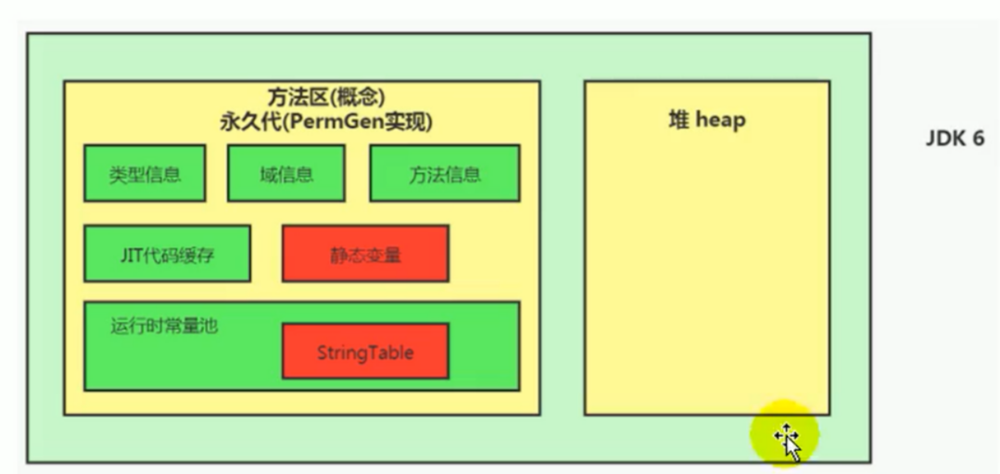

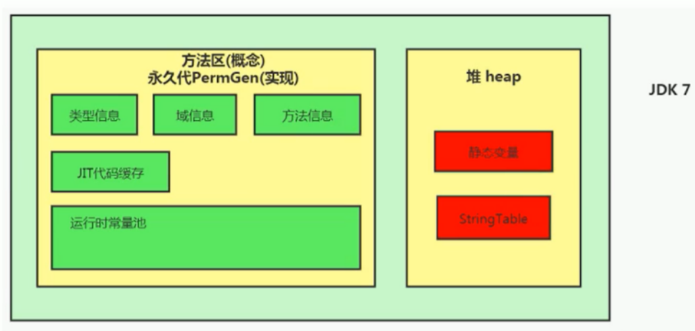

**StringTable为什么要调整？**

官网地址：[Java SE 7 Features and Enhancements (oracle.com)](https://www.oracle.com/java/technologies/javase/jdk7-relnotes.html#jdk7changes)

> **Synopsis:** In JDK 7, interned strings are no longer allocated in the permanent generation of the Java heap, but are instead allocated in the main part of the Java heap (known as the young and old generations), along with the other objects created by the application. This change will result in more data residing in the main Java heap, and less data in the permanent generation, and thus may require heap sizes to be adjusted. Most applications will see only relatively small differences in heap usage due to this change, but larger applications that load many classes or make heavy use of the `String.intern()` method will see more significant differences.

简介：在JDK 7中，内部字符串不再分配在Java堆的永久代中，而是分配在Java堆的主要部分（称为年轻代和老年代），与应用程序创建的其他对象一起。这种变化将导致更多的数据驻留在主Java堆中，而更少的数据在永久代中，因此可能需要调整堆的大小。大多数应用程序将看到由于这一变化而导致的堆使用的相对较小的差异，但<mark>加载许多类或大量使用String.intern()方法的大型应用程序将看到更明显的差异</mark>。

验证字符串常量池的位置

```java
/**
 * 证明字符串常量池在堆中
 * jdk1.6中设置方法区和堆空间的大小都为6M
 * -XX:PermSize=6m -XX:MaxPermSize=6m -Xms6m -Xmx6m
 *
 * jdk1.8中设置方法去和堆空间的大小都为6M
 * -XX:MetaspaceSize=64m -XX:MaxMetaspaceSize=64m -Xms6m -Xmx6m
 *
 */
public class StringTest3 {
    public static void main(String[] args) {
        HashSet<String> hashSet = new HashSet<>();
        long i = 0;
        while (true){
            //intern()方法：如果该字符串没有在字符串常量池中，将该字符串放入常量池中，然后返回其在常量池中的地址引用
            //否则，直接返回该字符串在常量池中的地址引用
            hashSet.add(String.valueOf(i ++).intern());
        }
    }
}
```

在jdk1.6的环境下：

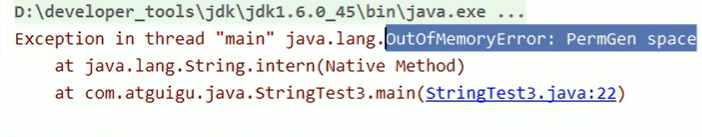

报错的内容是永久代OOM，所以可以证明在JDK1.6时，hotspot的字符串常量池在永久代中


在jdk1.8的环境下

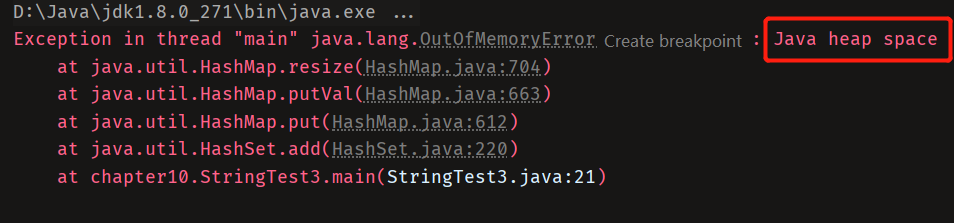

报错的内容是堆的OOM，可以证明在JDK1.8时，hotspot的字符串常量池移动到了堆空间

## 10.3. String的基本操作

```java
public class StringTest4 {
    public static void main(String[] args) {
        System.out.println();       //字符串数量2139
        System.out.println("1");    //字符串数量2140
        System.out.println("2");
        System.out.println("3");
        System.out.println("4");
        System.out.println("5");
        System.out.println("6");
        System.out.println("7");
        System.out.println("8");
        System.out.println("9");
        System.out.println("10");   //2150


        System.out.println("1");    //2150
        System.out.println("2");    //2150
        System.out.println("3");    //2150
        System.out.println("4");    //后续字符串的取出都是从字符串常量池中取出来的，不会再次加载
        System.out.println("5");
        System.out.println("6");
        System.out.println("7");
        System.out.println("8");
        System.out.println("9");
        System.out.println("10");
    }
}
```

Java语言规范里要求完全相同的字符串字面量，应该包含同样的Unicode字符序列（包含同一份码点序列的常量），并且必须是指向同一个String类实例。

```java
class Memory {
    public static void main(String[] args) {//line 1
        int i= 1;//line 2
        Object obj = new Object();//line 3
        Memory mem = new Memory();//Line 4
        mem.foo(obj);//Line 5
    }//Line 9
    private void foo(Object param) {//line 6
        String str = param.toString();//line 7
        System.out.println(str);
    }//Line 8
}
```

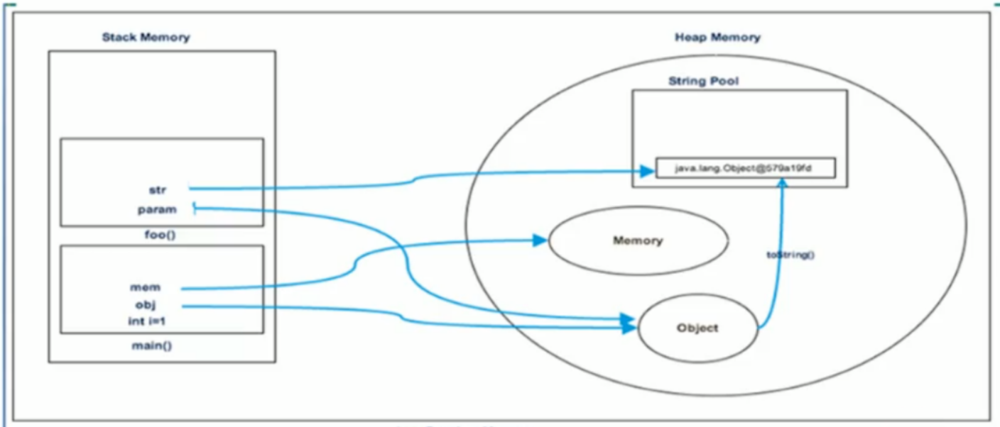

## 10.4. 字符串拼接操作

- **常量与常量的拼接结果在常量池，原理是编译期优化**
- **常量池中不会存在相同内容的变量**
- **只要其中有一个是变量，结果就在堆中（非常量池区域），相当于新new了一个字符串对象。变量拼接的原理是StringBuilder**
- **如果拼接的结果调用intern()方法，则主动将常量池中还没有的字符串对象放入池中，并返回此对象地址**

**举例1**

```java
public static void test1(){
    String s1 = "a" + "b" + "c";
    String s2 = "abc";      //一定放在字符串常量池中，将此地址赋值给s2

    /**
         * 最终.java编译成.class，再执行.class
         * String s1 = "abc";
         * String s2 = "abc";
         */
    System.out.println(s1 == s2);       //true
    System.out.println(s1.equals(s2));  //true
}
```

  **举例2**

```java
public static void test2(){
    String s1 = "javaee";
    String s2 = "hadoop";

    String s3 = "javaeehadoop";
    String s4 = "javaee" + "hadoop";
    String s5 = s1 + "hadoop";
    String s6 = "javaee" + s2;

    String s7 = s1 + s2;

    System.out.println(s3 == s4);   //true 常量与常量的拼接结果在常量池，原理是编译期优化
    System.out.println(s3 == s5);   //false 只要其中有一个是变量，结果就在堆中（非常量池区域），相当于新new了一个字符串对象。变量拼接的原理是StringBuilder
    System.out.println(s3 == s6);   //false 只要其中有一个是变量，结果就在堆中（非常量池区域），相当于新new了一个字符串对象。变量拼接的原理是StringBuilder
    System.out.println(s3 == s7);   //false 只要其中有一个是变量，结果就在堆中（非常量池区域），相当于新new了一个字符串对象。变量拼接的原理是StringBuilder
    System.out.println(s5 == s6);   //false 只要其中有一个是变量，结果就在堆中（非常量池区域），相当于新new了一个字符串对象。变量拼接的原理是StringBuilder
    System.out.println(s5 == s7);   //false 只要其中有一个是变量，结果就在堆中（非常量池区域），相当于新new了一个字符串对象。变量拼接的原理是StringBuilder
    System.out.println(s6 == s7);   //false 只要其中有一个是变量，结果就在堆中（非常量池区域），相当于新new了一个字符串对象。变量拼接的原理是StringBuilder


    //intern():判断字符串常量池中是否存在javaeehadoop的值，如果存在，则返回常量池中javaeehadoop的地址
    //如果不存在，则在常量池中加载一份javaeehadoop,并返回此对象的地址
    String s8 = s6.intern();        //调用intern 将字符串s6 的内容放入到字符串常量池中，然后返回其在常量池中位置的引用
    System.out.println(s3 == s8);   //true
}
```

**举例3**

```java
public static void test3(){
    String s1 = "a";
    String s2 = "b";
    String s3 = "ab";
    /*
            s1 + s2 的执行细节
            StringBuilder sb = new StringBuilder();
            sb.append("a");
            sb.append("b");
            sb.toString();  //约等于new String("ab");
            JDK5.0 之后用的是StringBuilder 之前用的是StringBuffer
         */
    String s4 = s1 + s2;
    System.out.println(s3 == s4);   //false
}
```

- "+"  本质上使用的是StringBuilder进行拼接
  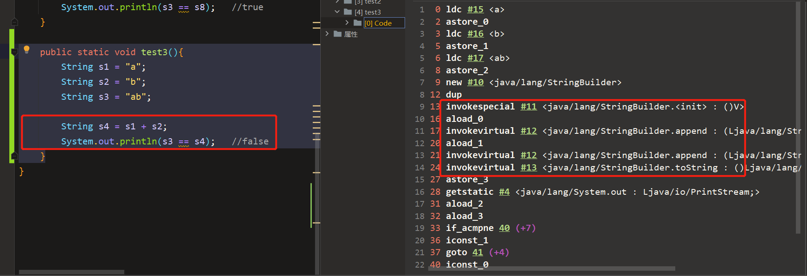
- 不使用final修饰，即为变量。如s3行的s1和s2，会通过new StringBuilder进行拼接

**举例4**

```java
public static void test4(){
    final String s1 = "a";
    final String s2 = "b";
    String s3 = "ab";
    /**
         * 1.字符串拼接操作不一定使用的是StringBuilder,
         * 如果拼接符号左右两边都是字符串常量(字面量)或者常量引用(final定义的常量的引用)
         * 则仍然使用编译器优化，即非StringBuilder的方式
         * 
         * 2.针对于final修饰类、方法、基本数据类型、引用数据类型的量的结构时
         * 尽量加上final
         */
    String s4 = s1 + s2;
    System.out.println(s3 == s4);   //true
}
```

- 使用final修饰，即为常量。会在编译器进行代码优化。<mark>在实际开发中，能够使用final的，尽量使用</mark>
- 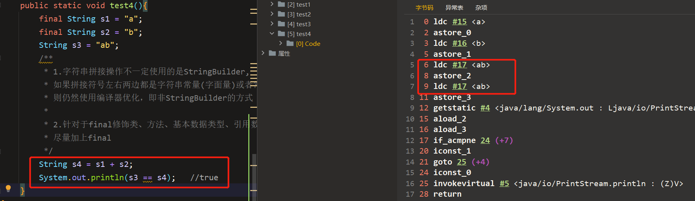

**举例5**

```java
public static void test5(int highLevel){
    String src = "";
    for (int i = 0; i < highLevel; i++) {
        //每次拼接都会创建一个StringBuilder对象，并调用toString()创建一个String
        //内存中创建了许多StringBuilder和String,会占用内很多内存，而且因为创建了
        //很多对象，导致GC的压力增大
        src = src + "a";
    }

    //只有一个StringBuilder，每次添加一个字符串"a"
    //append()方式添加字符串的效率要远高于String的字符串拼接方式
    StringBuilder sb = new StringBuilder("");
    for (int i = 0; i < highLevel; i++) {
        sb.append("a");
    }

    //优化
    //在实际开发中，如果基本确定一共要添加的字符串数量不高于某个限定值highlevel
    //的情况下，要考虑使用带有初始容量的构造器进行实例化，避免扩容和复制操作带来的性能损耗
    StringBuilder sbs = new StringBuilder(highLevel + 1);
    for (int i = 0; i < highLevel; i++) {
        sbs.append("a");
    }
}
```

**字节码**

我们拿例4的字节码进行查看，可以发现`s1 + s2`实际上是new了一个StringBuilder对象，并使用了append方法将s1和s2添加进来，最后调用了toString方法赋给s4

```shell
 0 ldc #2 <a>
 2 astore_1
 3 ldc #3 <b>
 5 astore_2
 6 ldc #4 <ab>
 8 astore_3
 9 new #5 <java/lang/StringBuilder>
12 dup
13 invokespecial #6 <java/lang/StringBuilder.<init>>
16 aload_1
17 invokevirtual #7 <java/lang/StringBuilder.append>
20 aload_2
21 invokevirtual #7 <java/lang/StringBuilder.append>
24 invokevirtual #8 <java/lang/StringBuilder.toString>
27 astore 4
29 getstatic #9 <java/lang/System.out>
32 aload_3
33 aload 4
35 if_acmpne 42 (+7)
38 iconst_1
39 goto 43 (+4)
42 iconst_0
43 invokevirtual #10 <java/io/PrintStream.println>
46 return
```

**字符串拼接操作性能对比**

```java
public class Test
{
    public static void main(String[] args) {
        int times = 50000;

        // String
        long start = System.currentTimeMillis();
        testString(times);
        long end = System.currentTimeMillis();
        System.out.println("String: " + (end-start) + "ms");

        // StringBuilder
        start = System.currentTimeMillis();
        testStringBuilder(times);
        end = System.currentTimeMillis();
        System.out.println("StringBuilder: " + (end-start) + "ms");

        // StringBuffer
        start = System.currentTimeMillis();
        testStringBuffer(times);
        end = System.currentTimeMillis();
        System.out.println("StringBuffer: " + (end-start) + "ms");
    }

    public static void testString(int times) {
        String str = "";
        for (int i = 0; i < times; i++) {
            str += "test";
        }
    }

    public static void testStringBuilder(int times) {
        StringBuilder sb = new StringBuilder();
        for (int i = 0; i < times; i++) {
            sb.append("test");
        }
    }

    public static void testStringBuffer(int times) {
        StringBuffer sb = new StringBuffer();
        for (int i = 0; i < times; i++) {
            sb.append("test");
        }
    }
}

// 结果
String: 7963ms
StringBuilder: 1ms
StringBuffer: 4ms
```

本实验进行5万次循环，String拼接方式的时间是StringBuilder.append方式的约8000倍，StringBuffer.append()方式的时间是StringBuilder.append()方式的约4倍

可以看到，通过StringBuilder的append方式的速度，要比直接对String使用“+”拼接的方式<mark>快的不是一点半点</mark>

那么，在实际开发中，对于需要<mark>多次或大量拼接</mark>的操作，在不考虑线程安全问题时，我们就应该尽可能<mark>使用StringBuilder进行append操作</mark>

除此之外，还有那些操作能够帮助我们提高字符串方面的运行效率呢？

StringBuilder空参构造器的初始化大小为16。那么，如果提前知道需要拼接String的个数，就应该直接使用<mark>带参构造器</mark>指定capacity，以减少扩容的次数（扩容的逻辑可以自行查看源代码）

```java
/**
 * Constructs a string builder with no characters in it and an
 * initial capacity of 16 characters.
 */
public StringBuilder() {
    super(16);
}

/**
 * Constructs a string builder with no characters in it and an
 * initial capacity specified by the {@code capacity} argument.
 *
 * @param      capacity  the initial capacity.
 * @throws     NegativeArraySizeException  if the {@code capacity}
 *               argument is less than {@code 0}.
 */
public StringBuilder(int capacity) {
    super(capacity);
}
```

## 10.5. intern()的使用

官方API文档中的解释

> public String intern()
>
> Returns a canonical representation for the string object.
>
> A pool of strings, initially empty, is maintained privately by the class `String`.
>
> When the intern method is invoked, if the pool already contains a string equal to this `String` object as determined by the [`equals(Object)`](https://docs.oracle.com/javase/8/docs/api/java/lang/String.html#equals-java.lang.Object-) method, then the string from the pool is returned. Otherwise, this `String` object is added to the pool and a reference to this `String` object is returned.
>
> It follows that for any two strings `s` and `t`, `s.intern() == t.intern()` is `true` if and only if `s.equals(t)` is `true`.
>
> All literal strings and string-valued constant expressions are interned. String literals are defined in section 3.10.5 of the The Java™ Language Specification.
>
> - **Returns:**
>
>   a string that has the same contents as this string, but is guaranteed to be from a pool of unique strings.

当调用intern方法时，如果池子里已经包含了一个与这个String对象相等的字符串，正如equals(Object)方法所确定的，那么池子里的字符串会被返回。否则，这个String对象被添加到池中，并返回这个String对象的引用。

由此可见，对于任何两个字符串s和t，当且仅当s.equals(t)为真时，s.intern() == t.intern()为真。

所有字面字符串和以字符串为值的常量表达式都是interned。

返回一个与此字符串内容相同的字符串，但保证是来自一个唯一的字符串池。

---

intern是一个native方法，调用的是底层C的方法

```java
public native String intern();
```

如果不是用双引号声明的String对象，可以使用String提供的intern方法，它会从字符串常量池中查询当前字符串是否存在，若不存在就会将当前字符串放入常量池中。

```java
String myInfo = new string("I love atguigu").intern();
```

也就是说，如果在任意字符串上调用String.intern方法，那么其返回结果所指向的那个类实例，必须和直接以常量形式出现的字符串实例完全相同。因此，下列表达式的值必定是true

```java
("a"+"b"+"c").intern() == "abc"
```

通俗点讲，Interned string就是确保字符串在内存里只有一份拷贝，这样可以节约内存空间，加快字符串操作任务的执行速度。注意，这个值会被存放在字符串内部池（String Intern Pool）

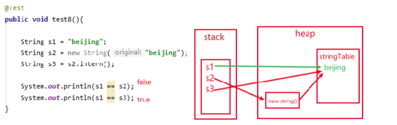

### 10.5.1. intern的使用：JDK6 vs JDK7/8

**两道题**

```bash
1. new String("ab") 会创建几个对象？
```

```java
public class StringTest6 {
    public static void main(String[] args) {
        String str = new String("abc");
    }
}
```

答案是两个，从字节码部分可以看出来

```bash
 0 new #2 <java/lang/String>	#创建一个字符串对象，这是第一个，在对空间创建的
 3 dup
 4 ldc #3 <abc>		# 加载字符串中的"abc"对象。这是第二个，字符串常量池中的对象
 6 invokespecial #4 <java/lang/String.<init> : (Ljava/lang/String;)V>	#使用常量池中的字符串对象来初始化new出来的字符串对象
 9 astore_1
10 return
```

```bash
2.new String("a") + new String("b") 会创建几个对象？
```

```java
public class StringTest6 {
    public static void main(String[] args) {
//        String str = new String("abc");
        String str = new String("a") + new String("b");
    }
}
```

答案是6个，看字节码分析

```bash
 0 new #2 <java/lang/StringBuilder>	# 1.字符串拼接操作，会创建一个StringBuilder对象
 3 dup
 4 invokespecial #3 <java/lang/StringBuilder.<init> : ()V>
 7 new #4 <java/lang/String>	# 2.创建一个String对象
10 dup
11 ldc #5 <a>					# 3.常量池中创建一个字符串"a"对象
13 invokespecial #6 <java/lang/String.<init> : (Ljava/lang/String;)V>
16 invokevirtual #7 <java/lang/StringBuilder.append : (Ljava/lang/String;)Ljava/lang/StringBuilder;>
19 new #4 <java/lang/String>	# 4.创建一个String对象
22 dup
23 ldc #8 <b>				#5.常量池中创建一个字符串"b"对象
25 invokespecial #6 <java/lang/String.<init> : (Ljava/lang/String;)V>
28 invokevirtual #7 <java/lang/StringBuilder.append : (Ljava/lang/String;)Ljava/lang/StringBuilder;>
31 invokevirtual #9 <java/lang/StringBuilder.toString : ()Ljava/lang/String;> # 6.StringBuilder调用toString方法，生成一个新的String对象，这里就不会在字符串常量池中创建"ab"这个字符串常量了
34 astore_1
35 return
```

**正式演示**

```java
/**
 * ① String s = new String("1")
 * 创建了两个对象
 * 		堆空间中一个new对象
 * 		字符串常量池中一个字符串常量"1"（注意：此时字符串常量池中已有"1"），因为这个"1"是以字面量的形式定义的
 * ② s.intern()由于字符串常量池中已存在"1"
 * 
 * s  指向的是堆空间中的对象地址
 * s2 指向的是堆空间中常量池中"1"的地址
 * 所以不相等
 */
String s = new String("1");
s.intern();		//调用intern时，常量池中已经有了"1"，所以没啥操作
String s2 = "1";	//指向常量池中的那个"1"
System.out.println(s==s2); // jdk1.6 false jdk7/8 false

/*
 * ① String s3 = new String("1") + new String("1")
 * s3要经历创建StringBuilder，调用toString方法的过程，最终本质上还是new String("11")
 * 但是经过StringBuilder，然后toString后的字符串，并不会放到常量池中，即"11"不会放到常量池
 * 等价于new String（"11"），但是，常量池中并不生成字符串"11"；
 *
 * ② s3.intern()
 * 由于此时常量池中并无"11"，所以把s3中记录的对象的地址存入常量池
 * 所以s3 和 s4 指向的都是一个地址
*/
String s3 = new String("1") + new String("1");
s3.intern();	//在字符串常量池中生成"11"。在jdk6中，在字符串常量池（永久代）中创建了一个新的对象"11"，也就有了新的地址。当创建其他的变量如 String s4 = "11"时，s4指向的就是字符串常量池（永久代）对象"11"的地址了。
//在jdk7/8中，因为堆中已经有了new String("11")这个对象了，调用intern方法，仅会在字符串常量池（堆）中创建一个指向new //String("11")的指针。
String s4 = "11";	//使用的是s3.intern()在常量池中生成的"11"的地址，发现该地址是一个指向new String("11")的指针，便将该指针指向的地址返回给s4
System.out.println(s3==s4); //jdk1.6 false jdk7/8 true


String s3 = new String("1") + new String("1");	//与前面同理
String s4 = "11";	// 在字符串常量池中生成对象"11"
s3.intern();	// 字符串常量池中已经有了值为"11"的字符串，不做任何操作
System.out.println(s3 == s4) //false
```

先s3.intern()后定义 String s4 = "11"

.png)

先定义String s4 = "11" 后进行 s3.intern()


总结String的intern()的使用：

JDK1.6中，将这个字符串对象尝试放入串池。

- 如果串池中有，则并不会放入。返回已有的串池中的对象的地址
- 如果没有，会把此<mark>对象复制一份</mark>，放入串池，并返回串池中的对象地址

JDK1.7起，将这个字符串对象尝试放入串池。

- 如果串池中有，则并不会放入。返回已有的串池中的对象的地址
- 如果没有，则会把<mark>对象的引用地址</mark>复制一份，放入串池，并返回串池中的引用地址

**练习1**

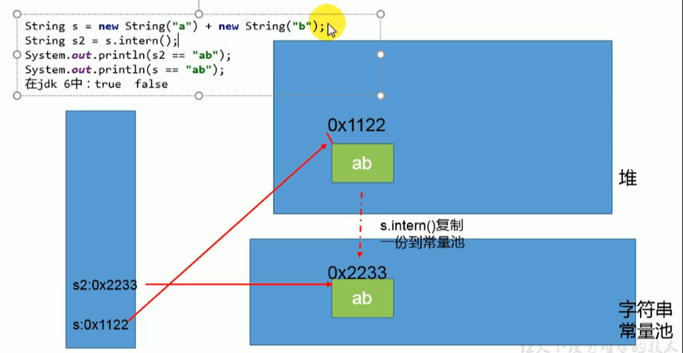

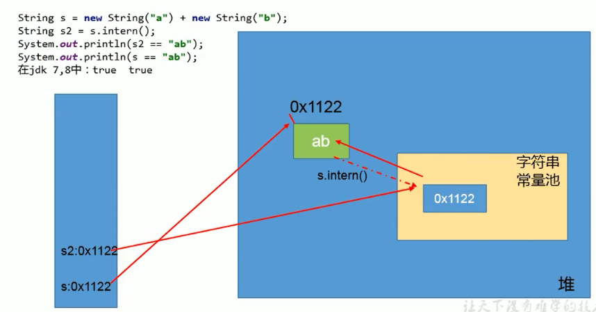

**练习2**

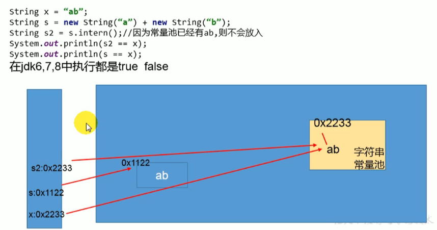

### 10.5.2. intern的效率测试：空间角度

我们通过测试一下，使用了intern和不使用的时候，其实相差还挺多的

```java
public class StringIntern2 {
    static final int MAX_COUNT = 1000 * 10000;
    static final String[] arr = new String[MAX_COUNT];

    public static void main(String[] args) {
        Integer [] data = new Integer[]{1,2,3,4,5,6,7,8,9,10};
        long start = System.currentTimeMillis();
        for (int i = 0; i < MAX_COUNT; i++) {
            // arr[i] = new String(String.valueOf(data[i%data.length]));
            arr[i] = new String(String.valueOf(data[i%data.length])).intern();
        }
        long end = System.currentTimeMillis();
        System.out.println("花费的时间为：" + (end - start));

        try {
            Thread.sleep(1000000);
        } catch (Exception e) {
            e.getStackTrace();
        }
    }
}

// 运行结果
不使用intern：7256ms
使用intern：1395ms
```

**结论**：对于程序中大量使用存在的字符串时，尤其存在很多已经重复的字符串时，使用intern()方法能够节省内存空间。

大的网站平台，需要内存中存储大量的字符串。比如社交网站，很多人都存储：北京市、海淀区等信息。这时候如果字符串都调用intern()方法，就会很明显降低内存的大小。

## 10.6. StringTable的垃圾回收

```java
public class StringGCTest {
    /**
     * -Xms15m -Xmx15m -XX:+PrintGCDetails
     */
    public static void main(String[] args) {
        
        for (int i = 0; i < 100000; i++) {
            String.valueOf(i).intern();
        }
    }
}
```

运行结果

```java
[GC (Allocation Failure) [PSYoungGen: 4096K->504K(4608K)] 4096K->1689K(15872K), 0.0581583 secs] [Times: user=0.00 sys=0.00, real=0.06 secs] 
[GC (Allocation Failure) [PSYoungGen: 4600K->504K(4608K)] 5785K->2310K(15872K), 0.0015621 secs] [Times: user=0.00 sys=0.00, real=0.00 secs] 
[GC (Allocation Failure) [PSYoungGen: 4600K->504K(4608K)] 6406K->2350K(15872K), 0.0034849 secs] [Times: user=0.00 sys=0.00, real=0.00 secs] 
Heap
 PSYoungGen      total 4608K, used 1919K [0x00000000ffb00000, 0x0000000100000000, 0x0000000100000000)
  eden space 4096K, 34% used [0x00000000ffb00000,0x00000000ffc61d30,0x00000000fff00000)
  from space 512K, 98% used [0x00000000fff00000,0x00000000fff7e010,0x00000000fff80000)
  to   space 512K, 0% used [0x00000000fff80000,0x00000000fff80000,0x0000000100000000)
 ParOldGen       total 11264K, used 1846K [0x00000000ff000000, 0x00000000ffb00000, 0x00000000ffb00000)
  object space 11264K, 16% used [0x00000000ff000000,0x00000000ff1cd9b0,0x00000000ffb00000)
 Metaspace       used 3378K, capacity 4496K, committed 4864K, reserved 1056768K
  class space    used 361K, capacity 388K, committed 512K, reserved 1048576K
```

## 10.7. G1中的String去重操作

官网地址：[JEP 192: String Deduplication in G1 (java.net)](http://openjdk.java.net/jeps/192)

> ## Motivation
>
> Many large-scale Java applications are currently bottlenecked on memory. Measurements have shown that roughly 25% of the Java heap live data set in these types of applications is consumed by `String` objects. Further, roughly half of those `String` objects are duplicates, where duplicates means `string1.equals(string2)` is true. Having duplicate `String` objects on the heap is, essentially, just a waste of memory. This project will implement automatic and continuous `String` deduplication in the G1 garbage collector to avoid wasting memory and reduce the memory footprint.

目前，许多大规模的Java应用程序在内存上遇到了瓶颈。测量表明，在这些类型的应用程序中，大约25%的Java堆实时数据集被`String'对象所消耗。此外，这些 "String "对象中大约有一半是重复的，其中重复意味着 "string1.equals(string2) "是真的。在堆上有重复的`String'对象，从本质上讲，只是一种内存的浪费。这个项目将在G1垃圾收集器中实现自动和持续的`String'重复数据删除，以避免浪费内存，减少内存占用。

---

注意这里说的重复，指的是在堆中的数据，而不是常量池中的，因为常量池中的本身就不会重复

背景：对许多Java应用（有大的也有小的）做的测试得出以下结果：

- 堆存活数据集合里面string对象占了25%
- 堆存活数据集合里面重复的string对象有13.5%
- string对象的平均长度是45

许多大规模的Java应用的瓶颈在于内存，测试表明，在这些类型的应用里面，<mark>Java堆中存活的数据集合差不多25%是String对象</mark>。更进一步，这里面差不多一半string对象是重复的，重复的意思是说： `stringl.equals(string2)= true`。<mark>堆上存在重复的String对象必然是一种内存的浪费</mark>。这个项目将在G1垃圾收集器中实现自动持续对重复的string对象进行去重，这样就能避免浪费内存。

**实现**

1. 当垃圾收集器工作的时候，会访问堆上存活的对象。<mark>对每一个访问的对象都会检查是否是候选的要去重的String对象</mark>
2. 如果是，把这个对象的一个引用插入到队列中等待后续的处理。一个去重的线程在后台运行，处理这个队列。处理队列的一个元素意味着从队列删除这个元素，然后尝试去重它引用的string对象。
3. 使用一个hashtable来记录所有的被String对象使用的不重复的char数组。当去重的时候，会查这个hashtable，来看堆上是否已经存在一个一模一样的char数组。
4. 如果存在，String对象会被调整引用那个数组，释放对原来的数组的引用，最终会被垃圾收集器回收掉。
5. 如果查找失败，char数组会被插入到hashtable，这样以后的时候就可以共享这个数组了。

**命令行选项**

```shell
# 开启String去重，默认是不开启的，需要手动开启。 
UseStringDeduplication(bool)  
# 打印详细的去重统计信息 
PrintStringDeduplicationStatistics(bool)  
# 达到这个年龄的String对象被认为是去重的候选对象
StringpeDuplicationAgeThreshold(uintx)  
```

